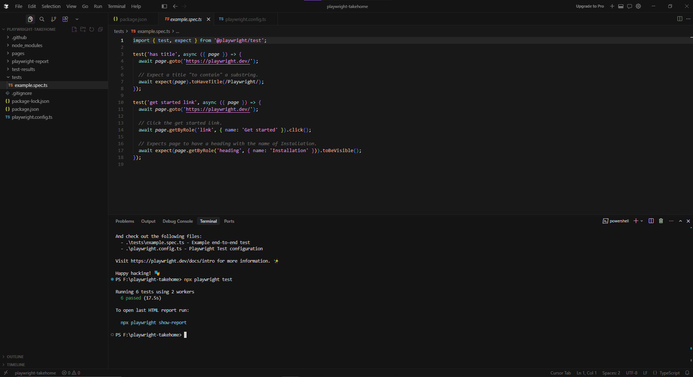

# Surgimate QA Automation Assessment - TodoMVC

## Overview
This repository contains a Playwright UI automation framework for the [TodoMVC Playwright Demo App](https://demo.playwright.dev/todomvc/). It is designed with a Page Object Model (POM) architecture.

## Architectural & Design Decisions

* **Page Object Model (POM):** All locators and actions are strictly encapsulated within `pages/TodoPage.ts`. The test spec contains only user journeys and assertions, ensuring maximum readability. Helper methods (e.g., `todoItemByText`) were implemented to keep the spec file DRY.
* **Accessibility-First Locators:** Prioritized web-first locators (`getByRole`, `getByPlaceholder`, `getByTestId`) over brittle CSS/XPath selectors to ensure tests survive UI styling changes.
* **State Management via `test.step`:** The 6-step user journey is executed sequentially within a single `test` block to perfectly preserve application state and avoid parallel worker collisions. `test.step()` is utilized to map the code directly to business requirements and generate highly readable HTML reports.
* **Strict Web-First Assertions:** Utilized Playwright's native auto-retrying assertions (`await expect(locator)`) and physical DOM count validations alongside logical UI text validations to verify both rendering and business logic independently.
* **TypeScript Configuration (`tsconfig.json`):** Deliberately included to enforce IDE strictness. While Playwright understands TypeScript natively during execution, the config provides robust developer experience (autocomplete, inline docs, and type-checking) for the test authoring phase.

## Prerequisites
* **Node.js**: v22.22.0 (LTS v18+ supported)
* **npm**: v11.11.0 (Comes with Node.js)

## Installation & Setup

1. Clone the repository and install dependencies:
```bash
   npm install
```

2. Install Playwright browser binaries (required for first-time setup):

```bash
npx playwright install
```

Without this step, tests fail with errors about missing browser binaries.

3. Run the tests

```bash
npx playwright test
```

You should see all tests pass in Chromium, Firefox, and WebKit.

## Running tests

## Running Tests

| Goal | NPX Command | NPM Script |
|------|-------------|------------|
| Run all tests | `npx playwright test` | `npm test` |
| Run only the todo spec | `npx playwright test tests/todo.spec.ts` | `npm run test:todo` |
| Run todo spec with browser visible | `npx playwright test tests/todo.spec.ts --headed` | `npm run test:todo:headed`|
| Interactive UI mode | `npx playwright test --ui` | `npm run test:ui` |
| Debug mode | `npx playwright test --debug` | `npm run test:debug` |
| Open last HTML report | `npx playwright show-report --port 8081` | `npm run test:report` |

Shortcut scripts from `package.json`:

```bash
npm test
npm run test:todo
npm run test:todo:headed
```

## Project layout

```
playwright-takehome/
├── pages/
│   └── Todo.ts          # Page Object: locators + actions
├── tests/
│   └── todo.spec.ts     # Main test flow (Assertions)
├── playwright.config.ts # Browsers, base URL, reporters
├── tsconfig.json        # TypeScript / IDE support
└── package.json
```

## Test flow (what is covered)

One spec exercises the demo end-to-end:

1. Add First Todo: Adds a single item and verifies the list and footer counter.
2. Add Second Todo: Adds a second item and verifies array text and plural counter logic.
3. Complete a Todo: Toggles a checkbox and verifies both rows remain visible while the active counter decrements.
4. Completed Filter: Asserts only the completed todo is shown.
5. Active Filter: Asserts only the active todo is shown.
6. Clear Completed: Switches to the "All" tab, clears the completed item, and verifies the final state.

## Known issues

- **Clear completed on “All”** — Clearing while on the Active filter hides completed rows from the DOM; that caused flaky failures in Firefox and WebKit. The test switches to All first.

## Screenshot of successful test run




## AI usage


## AI Usage Documentation (Cursor)
Per the assignment requirements, the following details the utilization of AI during the development of this framework:

* **Which assistant I used:** Cursor AI (Inline Autocomplete).
* **What I used it for:** I utilized Cursor strictly as an intelligent typing assistant (inline autocomplete) to accelerate the drafting of boilerplate syntax, basic Playwright assertions, and POM method definitions. All architectural logic was driven manually.
I also used the AI to generate the initial tsconfig.json to enforce strict type rules, and to draft the baseline structure of this README.md, which I heavily edited to accurately reflect my architectural decisions.
* **What I manually changed or corrected:** I manually intervened to discard AI-generated CSS/XPath selectors, replacing them with strict accessibility locators (getByTestId, getByRole).
* **Limitations and odd behavior noticed:** The inline autocomplete model heavily biases towards older Selenium-style patterns (e.g., trying to resolve locators natively via `expect(await locator)` instead of using web-first assertions). I had to strictly override these suggestions to enforce modern, deterministic state management via `test.step()`.


All test logic was reviewed and run locally before submission.
